# 🏠 AI Sales Coordinator System
### AI-Powered CRM Automation Built with n8n, OpenAI, Google Sheets, Gmail, and Telegram

---

## 📌 Overview

**AI Sales Coordinator System** is an end-to-end CRM automation project built for a real estate demo company, **Premier Realty**.

The system captures new property inquiries, qualifies and scores leads using AI, assigns each lead to the right sales agent, sends instant agent notifications, emails the lead automatically, creates follow-up tasks, sends scheduled follow-up emails, escalates overdue leads, and tracks all activities inside a Google Sheets CRM dashboard.

This project was built as a capstone-style automation system to demonstrate real-world workflow automation, AI lead qualification, CRM pipeline design, follow-up automation, and sales operations optimization.

---

## 🎯 Business Problem

Real estate teams often receive multiple inquiries from different channels. Without automation, teams may experience:

- Slow response times
- Manual lead review and assignment
- Missed high-priority leads
- Forgotten follow-ups
- No clear activity history
- Poor visibility into pipeline status
- Delayed escalation for overdue leads

This system solves those problems by acting as an **AI-powered sales coordinator** that manages the lead lifecycle from intake to follow-up and escalation.

---

## ✅ Solution

The system uses multiple connected n8n workflows and a Google Sheets CRM to automate the sales coordination process.

It can:

- Capture new lead inquiries through a webhook
- Normalize and prepare lead data
- Use OpenAI to score and classify leads as Hot, Warm, or Cold
- Assign leads to the appropriate sales agent
- Store lead records in Google Sheets
- Notify assigned agents through Telegram
- Send acknowledgement emails through Gmail
- Create first follow-up tasks automatically
- Send scheduled follow-up emails
- Update follow-up status after sending
- Escalate pending or overdue follow-ups
- Track all major activities in an activity log
- Display CRM metrics in a dashboard

---

## 🛠️ Tech Stack

| Tool | Purpose |
|------|---------|
| n8n | Workflow automation and orchestration |
| OpenAI GPT-4o Mini | AI lead qualification, scoring, and recommendations |
| Google Sheets | CRM database, activity log, follow-up queue, and dashboard |
| Gmail | Automated acknowledgement and follow-up emails |
| Telegram | Agent and manager notifications |
| Webhook / Hoppscotch | Lead inquiry testing |
| Docker | Local n8n environment |

---

## 🧠 System Architecture

The project is divided into three main n8n workflows.

---

### Workflow 1 — Lead Intake & Sales Coordination

This workflow runs when a new property inquiry is submitted.

```text
Lead Inquiry Form
↓
Normalize Lead Data
↓
AI Lead Qualification Engine
↓
Parse AI JSON Response
↓
Merge Lead + AI Data
↓
Lead Routing Decision
↓
Assign Sales Agent
↓
Create CRM Lead Record
↓
Notify Assigned Agent via Telegram
↓
Log Agent Notification
↓
Send Lead Acknowledgement Email
↓
Log Email Sent
↓
Create First Follow-Up Task
↓
Log Follow-Up Scheduled
```

**Business purpose:**  
Instantly qualify, prioritize, assign, and acknowledge every new lead.

---

### Workflow 2 — Follow-Up Automation Engine

This workflow runs on a schedule and checks the Follow-Ups sheet for pending follow-up tasks.

```text
Schedule Trigger
↓
Get Follow-Up Tasks
↓
Due Follow-Up?
↓
Send Follow-Up Email
↓
Update Follow-Up Status
↓
Activity Log: Follow-Up Sent
```

**Business purpose:**  
Ensure leads receive timely follow-up emails without manual reminders.

---

### Workflow 3 — Escalation & Lead Recovery Engine

This workflow checks pending follow-ups and escalates leads that need attention.

```text
Schedule Trigger
↓
Get Pending Follow-Ups
↓
Overdue Follow-Up?
↓
Notify Manager / Agent via Telegram
↓
Update Escalation Status
↓
Activity Log: Escalation Sent
```

**Business purpose:**  
Prevent leads from being forgotten by alerting the team when follow-ups need attention.

---

## 🤖 AI Lead Qualification

OpenAI analyzes each lead based on:

- Property type
- Budget
- Timeline
- Message intent
- Buying urgency
- Request for viewing or call
- Overall lead quality

The AI returns structured JSON with:

| Field | Description |
|-------|-------------|
| Lead Score | Numeric score from 0–100 |
| Lead Temperature | Hot, Warm, or Cold |
| Priority | High, Medium, or Low |
| Qualification Reason | Short explanation of the classification |
| Recommended Action | Suggested next action for the sales agent |
| Suggested Agent Type | Recommended sales specialty |

---

## 🧪 Sample Lead Input

```json
{
  "name": "Maria Lopez",
  "email": "maria@example.com",
  "phone": "09171234567",
  "property_type": "Residential",
  "budget": "8000000",
  "timeline": "Within 30 days",
  "message": "I am looking for a 3-bedroom house in Cavite and I want to schedule a viewing soon."
}
```

---

## 🧾 Sample AI Qualification Output

```json
{
  "lead_score": 85,
  "lead_temperature": "Hot",
  "priority": "High",
  "qualification_reason": "Maria has a clear intent to purchase a 3-bedroom house, within a short timeline and a strong budget.",
  "recommended_action": "Schedule a property viewing for Maria as soon as possible.",
  "suggested_agent_type": "Residential"
}
```

---

## 👥 Intelligent Lead Assignment

Leads are routed based on AI qualification and property type.

| Lead Type | Assigned Agent |
|----------|----------------|
| Hot + Residential / Condo | Anna Santos |
| Hot + Commercial / Land | Bob Reyes |
| Warm Lead | Bob Reyes |
| Cold Lead | Carl Cruz |

Each assigned lead includes:

- Assigned agent
- Agent email
- Agent phone
- Assigned date
- Agent specialty
- Lead status

---

## 📊 Google Sheets CRM Structure

The Google Sheets CRM contains multiple sheets:

| Sheet | Purpose |
|------|---------|
| Leads | Main lead database |
| Activity Log | Audit trail of all major sales actions |
| Follow-Ups | Follow-up task queue |
| Dashboard | CRM metrics and visual reporting |
| Lists | Dropdown values and reference data |

---

### Leads Sheet

Stores the main lead record, including:

- Lead ID
- Date Created
- Name
- Email
- Phone
- Property Type
- Budget
- Timeline
- Message
- Lead Score
- Lead Temperature
- Priority
- Qualification Reason
- Recommended Action
- Assigned Agent
- Lead Status
- Follow-Up Status
- Appointment Status
- Outcome
- Escalation Status

---

### Activity Log Sheet

Logs every important action, including:

- Lead assigned
- Agent notified
- Acknowledgement email sent
- Follow-up scheduled
- Follow-up email sent
- Escalation sent

Each log entry includes:

- Timestamp
- Lead ID
- Activity Type
- Description
- Agent
- Status
- Notes

---

### Follow-Ups Sheet

Stores follow-up tasks and automation status.

Important columns include:

- Lead ID
- Lead Name
- Lead Email
- Follow-Up Number
- Scheduled Date
- Status
- Sent Date
- Assigned Agent
- Email Type
- Priority
- Notes
- Escalation Status
- Escalated Date

---

## 📱 Telegram Notifications

The system sends Telegram alerts for:

- New assigned leads
- Overdue follow-ups
- Escalation reminders

Example alert:

```text
🚨 New Hot Lead Assigned

Lead ID: LEAD-20260610-125812
Name: Maria Lopez
Phone: 09171234567
Email: maria@example.com

Property Type: Residential
Budget: ₱8,000,000
Timeline: Within 30 days

AI Score: 85/100
Priority: High

Assigned Agent: Anna Santos
Specialty: Residential

AI Reason:
Maria has a clear intent to purchase a 3-bedroom house, within a short timeline and a strong budget.

Recommended Action:
Schedule a property viewing for Maria as soon as possible.
```

---

## 📧 Automated Email System

The project includes automated Gmail messages.

| Email Type | Trigger | Purpose |
|-----------|---------|---------|
| Lead Acknowledgement Email | Immediately after lead intake | Confirms the inquiry was received |
| Follow-Up Email | When a pending follow-up task is due | Re-engages the lead and offers next steps |
| Escalation Alert | When follow-up needs attention | Notifies manager or agent through Telegram |

---

## 📈 Dashboard

The Google Sheets dashboard shows live CRM metrics, including:

- Total leads
- Hot leads
- Warm leads
- Cold leads
- High-priority leads
- Assigned leads
- Pending follow-ups
- Sent follow-ups
- Escalated follow-ups
- Total activities logged
- Leads per agent
- Pipeline status
- Follow-up status
- Activity log summary

---

## 💼 Business Value

This system helps a sales team:

- Respond to leads faster
- Prioritize high-intent buyers
- Reduce manual CRM updates
- Improve follow-up consistency
- Prevent missed opportunities
- Create a reliable activity audit trail
- Give managers better pipeline visibility
- Automate repetitive sales coordination tasks

Estimated manual work reduced:

```text
5–15 minutes per lead → automated in seconds
```

---

## 🗂️ Project Screenshots

### Workflow 1 — Lead Intake & Sales Coordination

Shows the main workflow that captures a new lead, qualifies it using AI, assigns the lead to the right agent, creates the CRM record, sends notifications, creates the first follow-up task, and logs all activities.

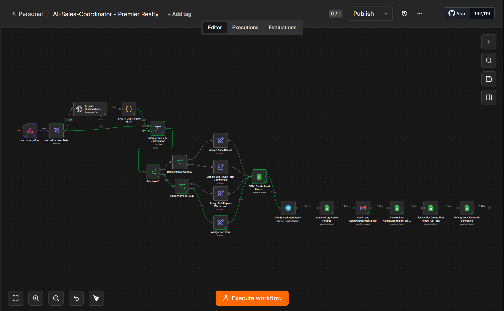

---

### Workflow 2 — Follow-Up Automation Engine

Shows the scheduled workflow that reads pending follow-up tasks, sends follow-up emails, updates the Follow-Ups sheet, and logs the completed follow-up activity.

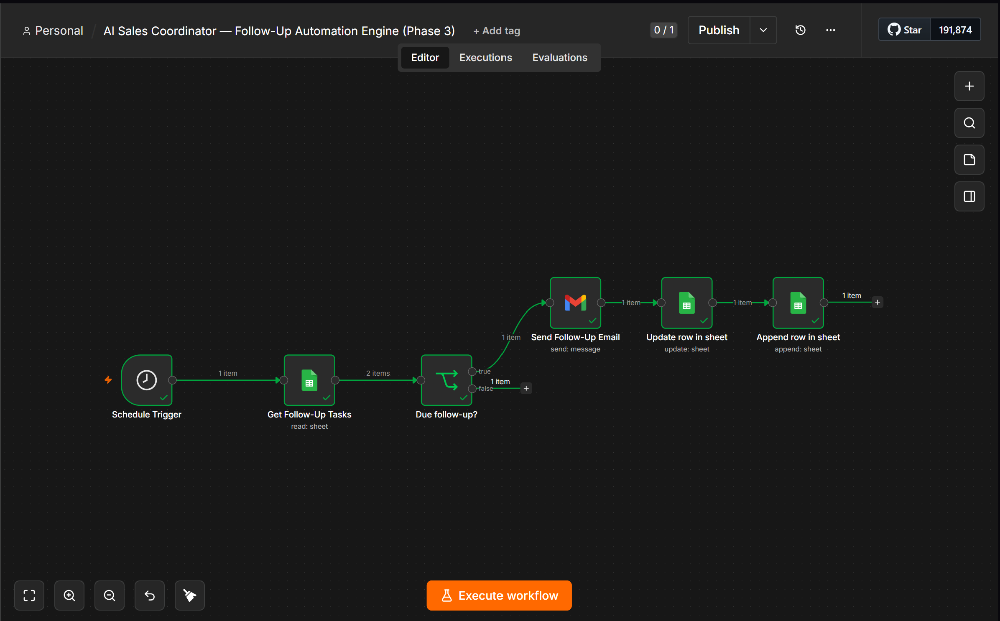

---

### Workflow 3 — Escalation & Lead Recovery Engine

Shows the scheduled escalation workflow that checks pending or overdue follow-ups, notifies the manager or assigned agent through Telegram, updates the escalation status, and logs the escalation event.

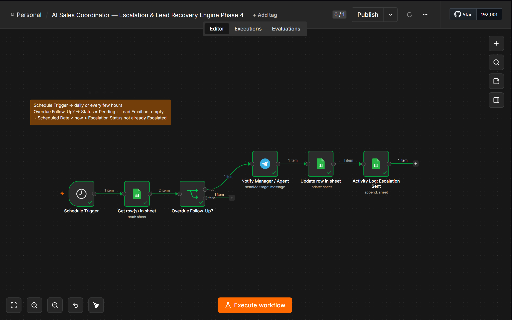

---

### Telegram Notifications

Agent and escalation notifications sent automatically through Telegram.

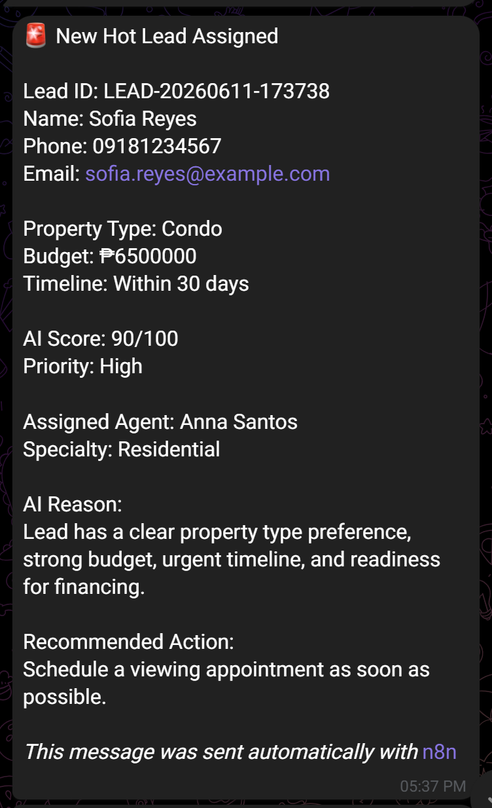

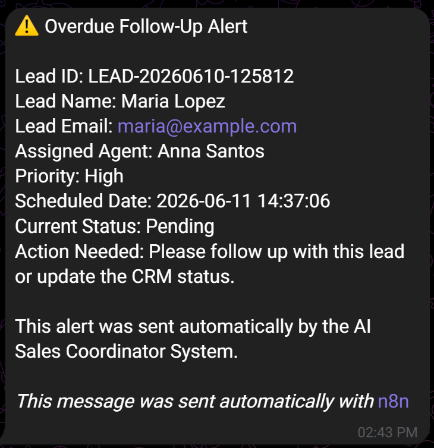

---

### Automated Emails

Automated Gmail messages sent to leads.

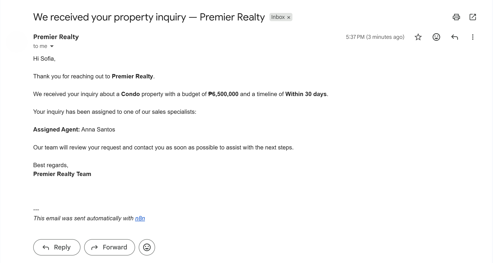

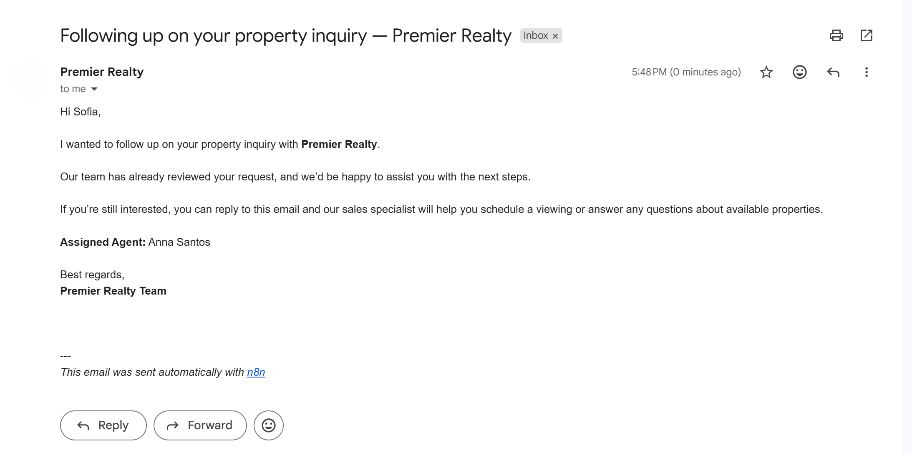

---

### Google Sheets CRM

CRM database, activity log, follow-up queue, and dashboard powered by Google Sheets.

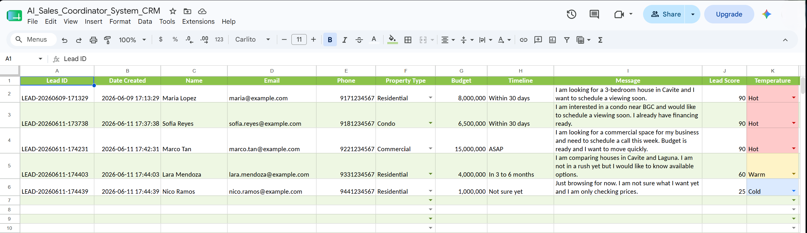

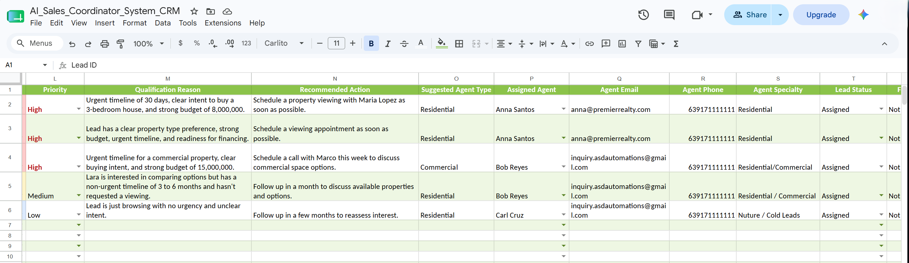

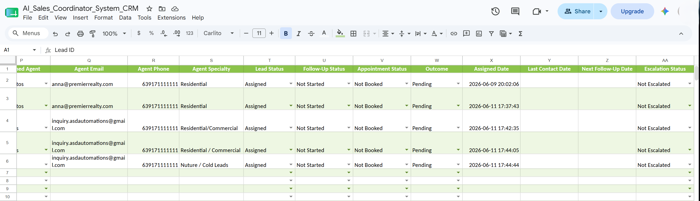

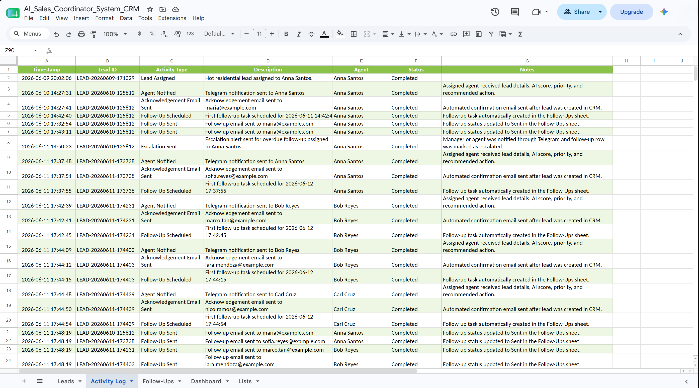

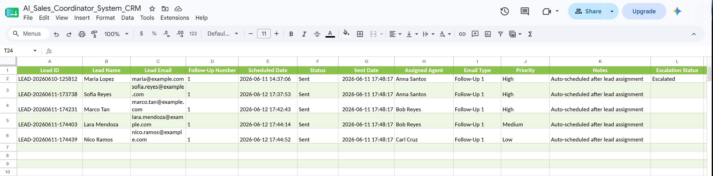

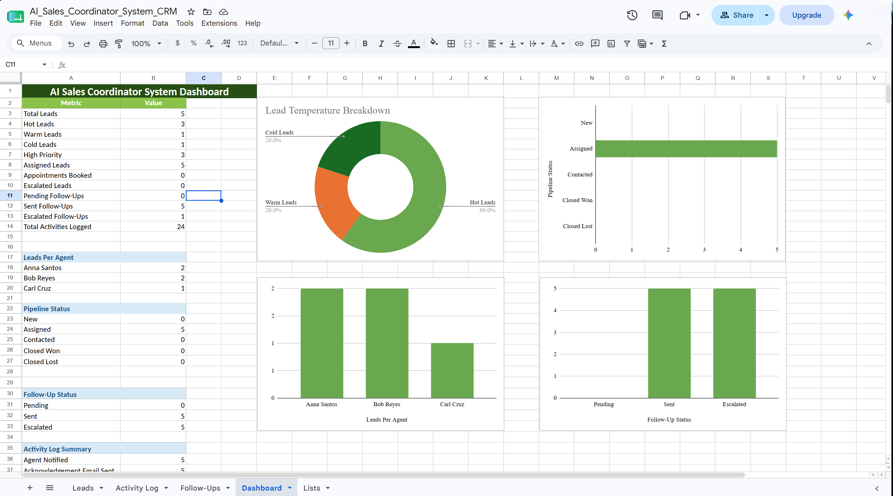

---

## 📁 Suggested Repository Structure

```text
AI-Sales-Coordinator-System/
│
├── README.md
│
├── workflows/
│   ├── lead-intake-sales-coordination.json
│   ├── follow-up-automation-engine.json
│   └── escalation-lead-recovery-engine.json
│
├── screenshots/
│   ├── workflow-lead-intake-sales-coordination.png
│   ├── workflow-follow-up-automation.png
│   ├── workflow-escalation-engine.png
│   ├── telegram-lead-alert.png
│   ├── telegram-escalation-alert.png
│   ├── email-lead-acknowledgement.png
│   ├── email-follow-up.png
│   ├── google-sheets-leads.png
│   ├── google-sheets-activity-log.png
│   ├── google-sheets-follow-ups.png
│   └── google-sheets-dashboard.png
│
├── crm-template/
│   └── AI-Sales-Coordinator-System-CRM.xlsx
│
└── docs/
    └── architecture-overview.md
```

---

## 🚀 Project Status

Completed:

- Phase 1 — AI Lead Qualification & CRM Foundation
- Phase 2 — Agent Notification, Lead Acknowledgement & Activity Logging
- Phase 3 — Follow-Up Automation Engine
- Phase 4 — Escalation & Lead Recovery Engine
- Phase 5 — Dashboard & Portfolio Polish

---

## 🧩 Production Notes

For a production setup, the following improvements are recommended:

- Add unique Follow-Up IDs for safer row updates
- Add due-date filtering before sending follow-up emails
- Change test schedule triggers to daily or business-hour schedules
- Replace demo emails and phone numbers with real team contacts
- Add error handling and failure notifications
- Move from Google Sheets to a dedicated CRM database when scaling
- Add authentication or form validation before accepting lead data

---

## 🔮 Future Improvements

Planned improvements:

- Add multiple follow-up sequences
- Add Google Calendar appointment booking
- Add lead response tracking
- Add CRM status update form for agents
- Add Slack or WhatsApp notifications
- Add AI-generated personalized follow-up messages
- Add conversion reporting
- Add lead response time tracking
- Migrate from Google Sheets to Supabase or HubSpot

---

## 👩‍💻 Built By

**Alieza San Diego**  
AI Automation Specialist | n8n • OpenAI • CRM Automation • Workflow Design

Specializing in AI-powered workflow automation for business operations, CRM systems, and repetitive process automation.

---

## ⚠️ Disclaimer

This project uses **Premier Realty** as a fictional demo company for portfolio and capstone purposes. Sample leads, agent names, contact details, and business data are used for demonstration and testing only.
